# TBC

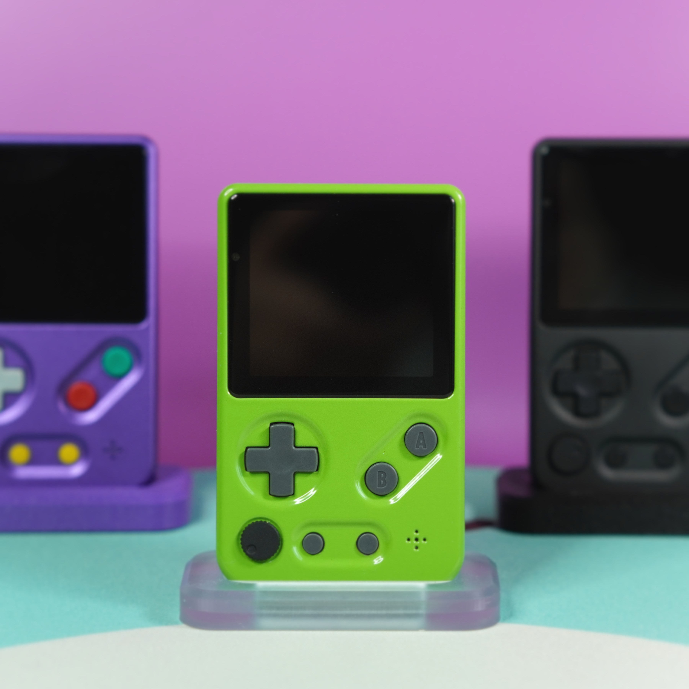

The Tad Boy color is an answer to the question: how small can you make a Game Boy Color while still accepting original cartridges? That's it, that's all you get.

# Attribution
Before getting to the build, it's important to provide attribution to the other project(s) that have in part gone into the Tad Boy Color.
- **[Gekkio/gekkio-kicad-libs](https://github.com/Gekkio/gekkio-kicad-libs)**: The TBC incorporates several of Gekkio's excellent kicad symbols and footprints, including for the CPU, RAM(modified), link port, and cartridge connector. Huge thanks to Gekkio for making these available for others to use!
- Cody Wick for the incredible name suggestion, holy shit

# License
The Tad Boy Color and associated files are licensed under a CC BY-NC-ND 4.0 license. In short, this means:
- If you share the files, you must provide attribution.
- Commercial uses are not allowed without permission, i.e. production and sale of Tad Boy Colors or parts for profit is not allowed.
- You are free to modify these files for your own private use, but you are not allowed to distribute modified files.
Full license is linked at the bottom of this document.

# Disclaimer/Warning/For the love of God, read this
The Tad Boy is not an easy project, nor is it a professional product, and as such there are some things to keep in mind as you consider building one.

Assembly of the Tad Boy requires intermediate-advanced skills in soldering and electronics tinkering, including:
- Desoldering/soldering of large ICs
- Desoldering of through hole parts
- Soldering of small surface mount components, down to 0402
- Soldering of leadless ICs, for example the TPS61202
- Proficiency with a multimeter for troubleshooting and validation

This is in no way a project for beginners, and if you don't have experience with the above, I highly recommend starting smaller -- solder practice kits are cheap and easily available.

Along with needing the requisite skills, there is a very real possibility that you will irreparably damage either your donor Game Boy Color, or the resulting Tad Boy. Even the most skilled among us make mistakes, but it's important to keep in mind your own limits to avoid heartache and sorrow.

I am in no way a professional electrical engineer. All of my skills are self taught, or learned from other members of the modding community. While I have taken common sense measures to ensure that the Frog Boy is functional and safe, I can not guarantee that each and every decision made is correct. Build at your own discretion.

In summary, build at your own risk. I am not liable for any damage or injury caused by your insatiable need to build a Game Boy named after a baby amphibian.

# Navigating this Repo
- The files you will need to produce the Tad Boy Color parts are located in the `production_files` folder.
  - Files for each major piece are located in their own subfolders.
  - In general, production files are named according to the name of the part plus a 6 digit date code indicating the date of release.
    - PCB versions are the exception to this rule, and are labeled according to the board revision, e.g. X5, 01, 02, etc
  - Production files for old parts are located in those parts' respective `archive` folders.
  - The latest versions of each part will be guaranteed to work with one another. I only recommend downloading archived versions if you really know what you're doing.
- An interactive BOM is available in the `ibom` folder. iBOMs for different PCB revisions are in their own subfolders. Select the iBOM version that matches your PCB.

# Bill of Materials(BOM)
Below is the breakdown of all materials you will need to build a Tad Boy Color.

## Build Components
- **PCB:** The Tad Boy Color uses a fully custom PCB designed to fit within the custom shell while still using many of the original GBC components. The following board parameters are **required**, all other paremeters(color, surface finish, etc) are up to you:
  - **Layers:** 4-layer
  - **Thickness:** 1mm
  - [**Order from PCBWay**](https://www.pcbway.com/project/shareproject/Tad_Boy_Color_876e4f73.html)
- **LCD Adapter Flex:** The shape of the board and LCD connector used on the main PCB requires the use of a custom flex cable to connect the TBC to the screen kit. The following parameters are **required**:
  - **Layers:** 2-layer
  - **Thickness:** 0.1mm or 0.11mm FFC
  - **Stiffener:** 0.2mm PI stiffener on edge connectors for total 0.3mm thickness. Have your chosen fab refer to the stiffener instructions on the "User Comments" layer
  - [**Order from PCBWay**](https://www.pcbway.com/project/shareproject/Tad_Boy_Color_LCD_Adapter_Flex_44b0462a.html)
- **Shell:** The shell for the Tad Boy Color is a fully custom design, designed specifically for CNC machining -- resin 3D printing should work, but is untested. Tested and verified materials are below, but all orders are at your own risk:
  - Verified CNC materials: Aluminum, polycarbonate, stainless steel
  - [**Order from PCBWay**](https://www.pcbway.com/project/shareproject/Tad_Boy_Color_876e4f73.html)
- **Volume Wheel:** The volume wheel is another custom piece, and is intended to be CNC machined. Resin printing will probably work, but is untested.
  - 081124 version can fit a 8mm(OD)x5mm(ID)x0.5mm PTFE coated nylon washer to reduce friction between wheel and shell.
  - [**Order from PCBWay**](https://www.pcbway.com/project/shareproject/Tad_Boy_Color_876e4f73.html)
- **Cartridge Shield:** Custom piece that fits behind the cartridge, allowing for a large enough opening in the metal shell to machine.
  - Verified 3D printing materials: FDM PLA, SLS nylon, MJF nylon
  - Verified CNC materials: Aluminum
  - [**Order from PCBWay**](https://www.pcbway.com/project/shareproject/Tad_Boy_Color_876e4f73.html)
- **Light pipe:** An optional light pipe can be added for the indicator LEDs to better diffuse them.
  - Verified 3D printing materials: FDM clear PLA, SLA clear resin
  - [**Order from PCBWay**](https://www.pcbway.com/project/shareproject/Tad_Boy_Color_876e4f73.html)
- **Screws:** The shell is designed to be put together using 7 x M2 3mm machine screws with flat tops. Options:
  - **450pcs M2 M2.5 M3 Screw Kit:** [From Amazon](https://www.amazon.com/gp/product/B07TDHZJLL/)
- **Buttons:** The Tad Boy Color uses buttons from the Game Boy Advance SP, either OEM or aftermarket. You will need a complete set, including the brightness button which is repurposed here as the power button. Some suggested buttons:
  - **FunnyPlaying:** [From RGRS](https://retrogamerepairshop.com/collections/gba-sp-buttons/products/funnyplaying-game-boy-advance-sp-buttons)
  - **RetroCNC(membrane version):** [From RGRS](https://retrogamerepairshop.com/collections/gba-sp-buttons/products/new-game-boy-sp-metal-buttons-by-retrocnc)
- **Membranes:** Similarly, the membranes used are also from the Game Boy Advance SP. Some suggested membranes:
  - **FunnyPlaying:** [From RGRS](https://retrogamerepairshop.com/collections/gba-sp-buttons/products/funnyplaying-game-boy-advance-sp-silicone-pads)
- **Screen:** This project is designed exclusively for the CGS 2.45" LCD kit for the Game Boy Color.
  - [Order from RGRS](https://retrogamerepairshop.com/collections/gbc-displays/products/game-boy-color-2-45-drop-in-backlight-lcd-kit?variant=41377297629356)
  - [Order from AliExpress](https://www.aliexpress.us/item/3256803777135552.html)
- **Screen Lens:** The Tad Boy color makes use of a custom designed glass screen lens. Suggested suppliers:
  - [**Order from FroggoCustoms**](https://froggocustoms.com/products/tad-boy-color-base-kit) - lens coming separately soon
  - Alibaba, requires obtaining quote with technical drawings
- **Battery:** The Tad Boy Color is designed to make use of aftermarket Joy Con batteries with minimal effort. The outer shroud/casing must be removed to fit properly. OEM batteries likely won't fit.

  NOTE: LiPo batteries can be dangerous if mishandled. NEVER use unprotected cells.

## Shell Ordering Notes
### CNC Machining
- When ordering the front shell, make sure you check the box indicating that you need tapped threads.
- For both front and back shells, be sure to include the technical drawings, and select 0.1mm as the tightest tolerance.

## PCB Components
- **Harvested GBC Parts:** You will need a donor GBC of revision CPU-05 or earlier -- CPU-06 revisions will NOT work -- that retains the following components in working order:
  - CPU
  - RAM
  - Link port(also available new: [AliExpress](https://www.aliexpress.us/item/3256803930669143.html))
- **New parts:** The full BOM for the Tad Boy Color be found in the repo, `bom.xlsx`. All non-Game Boy parts can be found in the shared Mouser cart below, and for that reason is the preferred vendor. Other parts can be obtained at the suggested links.
  - Non-Game Boy components:
    - [Mouser Shared Project](https://www.mouser.com/ProjectManager/ProjectDetail.aspx?AccessID=6273a53e17)
    - [DigiKey Shared Project](https://www.digikey.com/en/mylists/list/A9QP98UG8B) - NOTE: DigiKey does not stock the crystal or volume potentiometer. Order from Mouser if you can.
  - Game Boy Advance SP cartridge slot: [AliExpress](https://www.aliexpress.us/item/3256802533466823.html)
 
# Recommended Assembly Procedure
At this point, if you feel confident in your skills you can proceed with the complete build from PCB to final unit -- assembly after building the PCB is relatively straightforward.

However, I've devised an assembly strategy after assembling a few units that will allow you to check your work along the way, and I highly recommend that you follow along.

Unless otherwise noted, you should install all highlighted parts in a given step, and then proceed to the corresponding "Testing" section.

## PCB Assembly
### 1. Tactile switches
While this step can be done at any point of your choosing, I recommend doing it first for two reasons:
1. When using a hot plate to install the tactile switches, it's much easier to do so when the PCB is otherwise empty, and
2. Installing them early lets you better test in later stages.

| Front Parts | Back Parts |
| ----------- | ---------- |
| 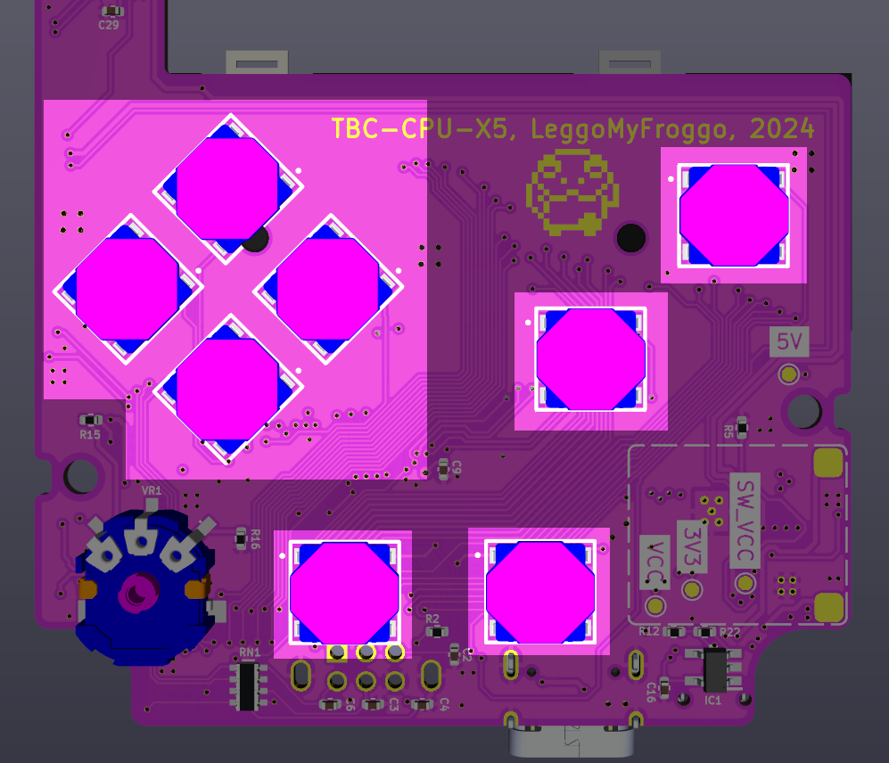   | N/A  |

### 2. Power
| Front Parts | Back Parts |
| ----------- | ---------- |
| 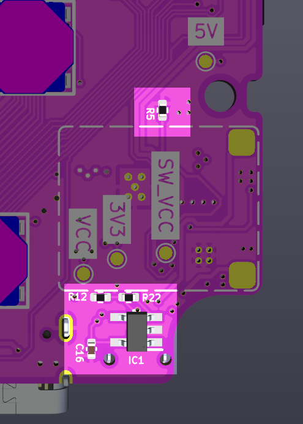 | 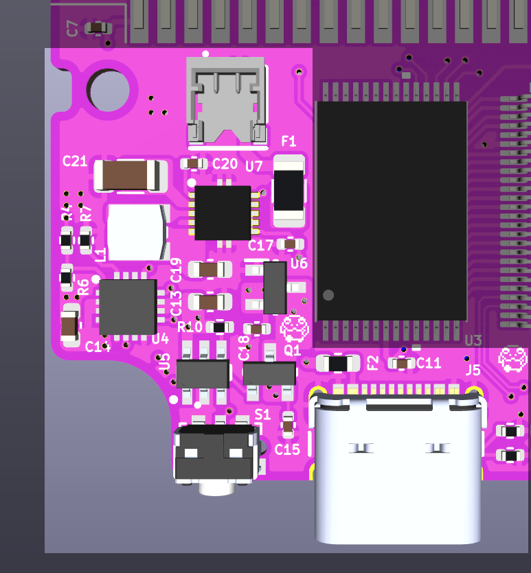 |

#### Testing:
To set up for testing, plug the battery into the battery connector below the cartridge slot. With your multimeter in DC voltage mode, verify test point voltages against these values in both on and off states for the system -- the system will be off initially. Tap the power button to toggle it on and off.
| Test Point | Off  | On  |
| ---------- | ---- | --- |
| SW_VCC     | BAT+ | BAT+ |
| VCC        | ~0V  | BAT+ |
| 5V         | ~0V  | 5V   |
| 3V3        | ~0V  | 3.3V |

NOTE: The VCC, 5V, and 3V3 rails may retain some voltage following system power down, but they should trend down to 0V over time.

### 3. The brains of the operation
| Front Parts | Back Parts |
| ----------- | ---------- |
| 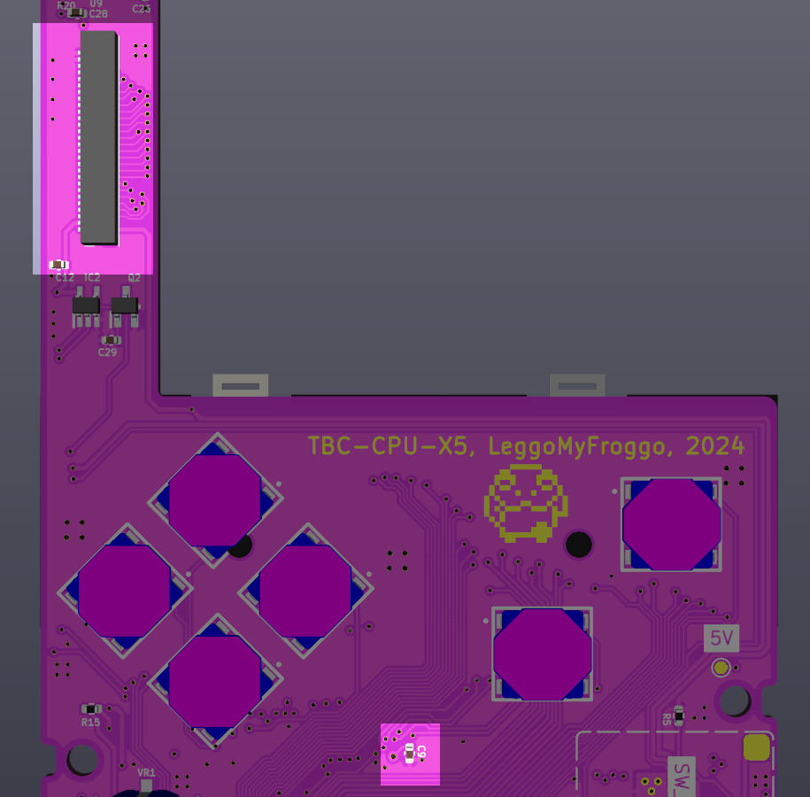 |  |

#### Testing:
1. Plug the larger end of the screen adapter flex cable into the screen driver board. Connector is bottom contact, meaning the gold fingers should face toward the surface of the PCB.
2. Plug the other end into the LCD connector on the motherboard. Connector is bottom contact, meaning the gold fingers should face toward the surface of the PCB.
3. Plug in the battery as in step 2.
4. Turn the system on by pressing the power button.
5. If all is well, you will see the familiar GBC boot screen appear. If the colors look funky, it's likely that not all CPU or RAM pins have been sufficiently joined to their pads. I highly recommend fixing this before installing the cart slot and link port as they will make access much harder.
6. Turn off the system and unplug the battery.

### 4. Cart slot
| Front Parts | Back Parts |
| ----------- | ---------- |
| 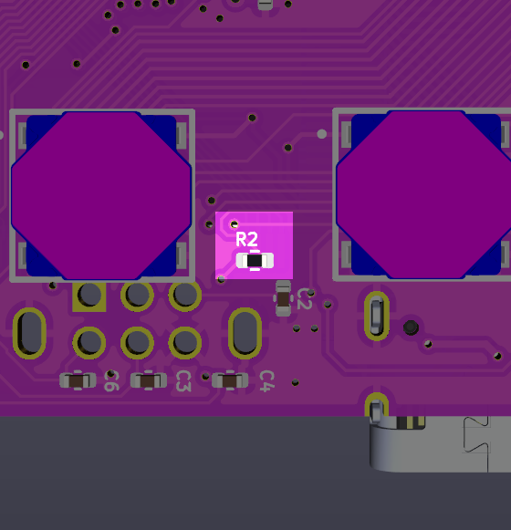 | 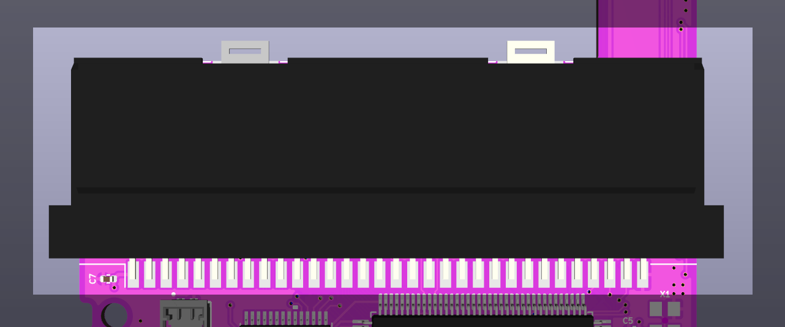 |

#### Testing:
1. Plug in the battery as in step 2.
2. Insert a cartridge into the cart slot.
3. Turn the system on by pressing the power button.
4. If all is well, the cartridge will boot and play correctly.
5. Turn off the system and unplug the battery.

### 5. Audio
| Front Parts | Back Parts |
| ----------- | ---------- |
| 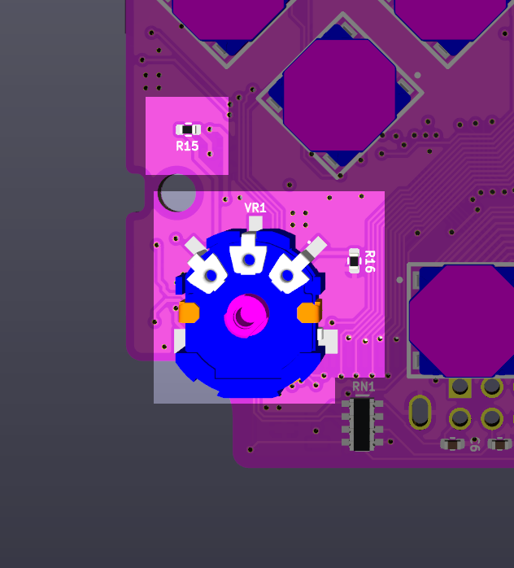 | 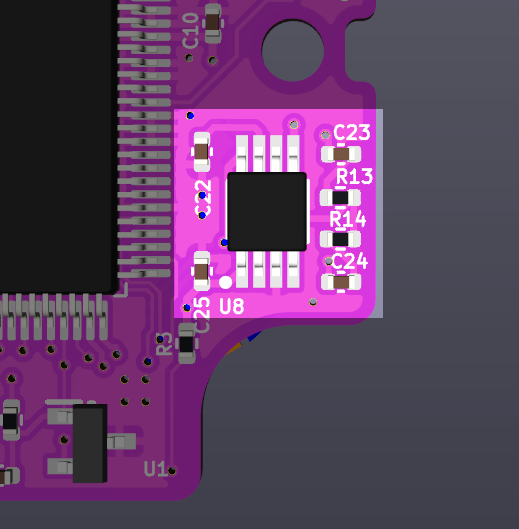 |

#### Testing:
1. Plug in the battery as in step 2.
2. Hold the contacts of the speaker to the corresponding pads on the motherboard.
3. Turn the system on by pressing the power button.
4. You should hear the start up "ding" if audio is working. If not, make sure the volume is turned up.
5. Turn off the system and unplug the battery.

### 6. Screen brightness control
| Front Parts | Back Parts |
| ----------- | ---------- |
| 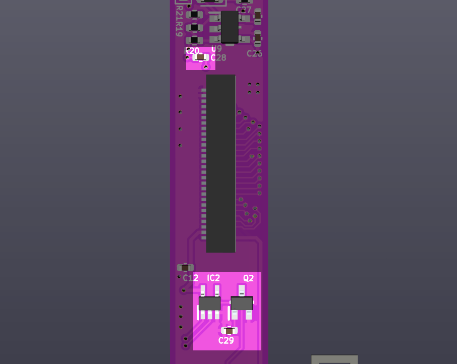 | N/A |

#### Testing:
1. Plug in the battery as in step 2.
2. Turn the system on by pressing the power button.
3. Press down + select at the same time and verify that the brightness level changes.
4. Long press down + select and verify that the pixel mode changes.
5. Turn off the system and unplug the battery.

### 7. Indicator LEDs
| Front Parts | Back Parts |
| ----------- | ---------- |
| 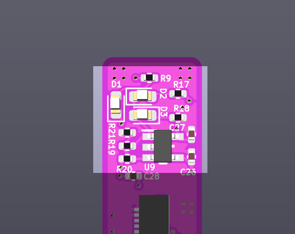 | N/A |

#### Testing:
1. Plug in the battery as in step 2.
2. Turn the system on by pressing the power button.
3. If the battery voltage is above 3.5V, D2 should illuminate. If it is below, D3 will illuminate.
4. Plug in a USB-C cable. D1 should illuminate to indicate that the battery is charging.
5. Turn off the system and unplug the battery.

### 8. EXT port
| Front Parts | Back Parts |
| ----------- | ---------- |
| 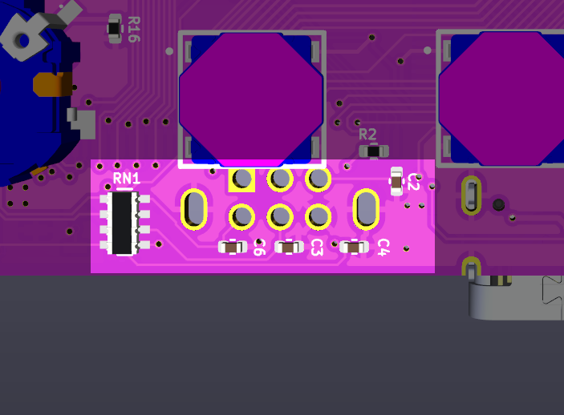 | 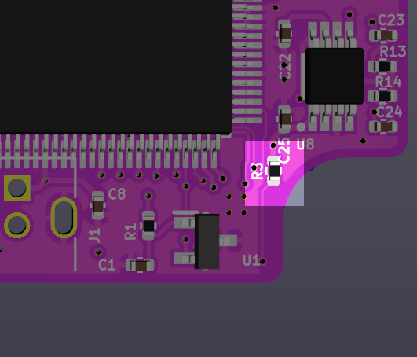 |

#### Testing:
1. Plug in the battery as in step 2.
2. Turn the system on by pressing the power button.
3. Connect a link cable from the EXT port to the EXT port of a known working Game Boy and verify functionality with a game of your choosing.
4. Turn off the system and unplug the battery.

<a property="dct:title" rel="cc:attributionURL" href="https://github.com/leggomyfroggo/TBC/">Tad Boy Color</a> by <a rel="cc:attributionURL dct:creator" property="cc:attributionName" href="https://github.com/leggomyfroggo">Chris Hackmann</a> is licensed under <a href="https://creativecommons.org/licenses/by-nc-nd/4.0/?ref=chooser-v1" target="_blank" rel="license noopener noreferrer" style="display:inline-block;">CC BY-NC-ND 4.0</a>

